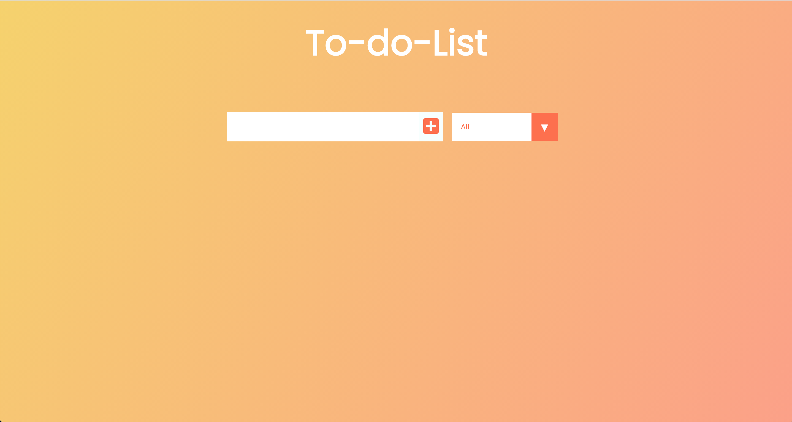
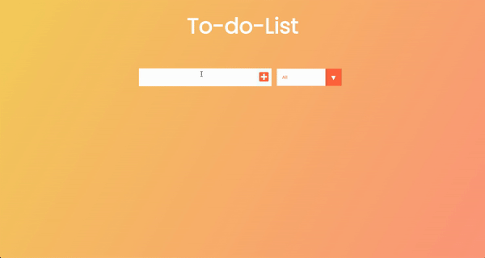

# Welcome! 👋


Since I'm an organized person, I like to always know what I need to do in the day so I created this To-Do-List to help me with my daily routines. This To-Do-List was a bit different from the other one that was made with only Vanilla JS. This application was made using React, CSS and Javascript.
</br>
You can checkout the demo here : <strong><a href="https://gustavomatsunaga.github.io/ToDoListReact/" target="_blank">To Do List</a></strong>

## Challenges! :pushpin:

The application was developed with React and Javascript. I made a CRUD (Create, read, update and delete) application in order to maintain my daily routines organized. Different from the other application built to be a To-Do-List, this one have some different features.

**New Features! Let's have fun!** 🚀

- [x] Change the taskes bettween completed and uncompleted.
- [x] Filter the taskes.
- [x] The taskes are stored in a local storage.

## Technologies! :computer:

<ul>
    <li>REACT</li>
    <li>HTML</li>
    <li>CSS</li>
    <li>JAVASCRIPT</li>
</ul>

# Web Model



## Desktop



# How to run the Project ! :bulb:

In the project directory, you can run:

## Clone Repository 

```
git clone https://github.com/GustavoMatsunaga/ToDoListReact
```

## Enter the directory :open_file_folder:

```
cd ToDoListReact
```

## Download dependecies

```
npm install
```

## Run Server

```
npm start
```

## Browser
Enter in the browser : 
```
https://localhost:3000/
```

# Credits :star2:
Designed by Gustavo Matsunaga! :octocat:

:gem: <a href="https://www.linkedin.com/in/gustavo-matsunaga-0628461a3/"><strong>Linkedin</a>